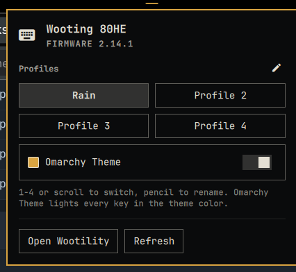

# Hall Keys

Profile switching, device info, and theme-matched lighting for Wooting Hall-effect
keyboards, right in the [Omarchy](https://omarchy.org/) bar.



- **Bar widget** is a keyboard glyph whose tooltip names the active onboard profile. Scroll
  on it to cycle profiles, click it for the panel.
- **Panel** switches between the keyboard's onboard profiles (keys 1-4 work too), lets you
  name them (the pencil), shows the model and firmware, and opens Wootility as an app
  window for everything else.
- **Omarchy Theme**, the fifth choice under the profiles, paints every key in the active
  theme's keyboard color and repaints when you switch themes. Picking a profile switches
  back to that profile's own lighting.

No Wootility, no daemon, no build step. The helper is a single Python 3 script that talks
HID to the keyboard, and Python 3 ships with Omarchy.

## Requirements

- Omarchy Quattro.
- A Wooting keyboard over USB. Both of Wooting's configuration protocols are supported:
  the classic one (tested on an 80HE with firmware 2.10) and the newer multi-report one
  (tested on the same 80HE after updating to firmware 2.14). Boards on the classic protocol
  get a note in the panel suggesting a firmware check in Wootility.
- Permission to open the keyboard's `/dev/hidraw` node (see below).

## Install

```sh
omarchy plugin add https://github.com/startupfoundry/omarchy-hall-keys.git --enable
```

The widget appears in the bar's right section. Move it with
`omarchy bar move io.github.startupfoundry.hall-keys --section left`.

## Keyboard access

Linux keeps raw HID access to keyboards private to root. The first time you open the panel
it will say **Keyboard access needed**. Click **Grant keyboard access**: it asks for your
password once through polkit and installs one udev rule,
`/etc/udev/rules.d/70-wooting-hidraw-uaccess.rules`, with the same device list as Wooting's
own Linux udev guide. The line that matters for current boards is:

```
SUBSYSTEM=="hidraw", ATTRS{idVendor}=="31e3", MODE:="0660", GROUP="input", TAG+="uaccess"
```

`uaccess` means only the user logged in at the seat gets access, and only while logged in.
Nothing else on the system changes. The same rule also makes the Wootility web app work in
Chromium-based browsers.

If you would rather do it by hand, copy the file from [`extras/70-wooting-hidraw-uaccess.rules`](extras/70-wooting-hidraw-uaccess.rules)
into `/etc/udev/rules.d/`, then run `udevadm control --reload && udevadm trigger --subsystem-match=hidraw`
as root. No logout is needed.

## Settings

Open Setup › Plugins › Hall Keys in the Omarchy menu, or edit the widget entry in
`~/.config/omarchy/shell.json`:

| Setting            | Default | What it does                                                    |
|--------------------|---------|-----------------------------------------------------------------|
| `themeLighting`    | `false` | Omarchy Theme is the active choice: paint the keyboard in the theme color and follow theme changes. |
| `pollInterval`     | `20`    | Seconds between profile checks.                                 |
| `profile1Name` … `profile4Name` | empty | Labels for the onboard profiles, also editable from the panel's pencil button. The keyboard does not store names (Wootility keeps its own in the browser), so these live in Omarchy. |

## Wootility

Actuation points, rapid trigger, remaps, and per-key lighting stay in Wootility, which is a
web app that needs WebHID. **Open Wootility** launches it through `omarchy-launch-webapp`,
so it gets its own app-style window in your default Chromium-based browser. Embedding it
inside the panel is not possible: Qt's web engine has no WebHID support.

**First launch.** Wootility shows every Linux user its "Allow Linux to detect your device"
page. A web page cannot see that the udev rule is already installed, so just scroll down and
continue. Then click **Find Devices**, pick the keyboard in the browser's device chooser, and
press **Connect**. The browser remembers that choice, so later launches go straight to the
keyboard until the next Wootility update asks again.

## Theme lighting

Every Omarchy theme can ship a `keyboard.rgb` file holding one hex color. Hall Keys reads it
from the active theme (`~/.local/state/omarchy/current/theme/keyboard.rgb`) and falls back to
the theme's accent color when a theme has none. The panel offers one active choice: a
profile, or **Omarchy Theme**. With the theme chosen, the whole board is set to that color
through the keyboard's host lighting mode and repainted after a theme switch; no profile
shows as selected, although the last profile stays active underneath for actuation and
remaps. Picking a profile hands lighting back to it. Unplugging the keyboard restores its
onboard lighting; Hall Keys repaints when it reconnects. **Refresh** re-reads the keyboard
and re-applies the color.

## Troubleshooting

Run the helper directly to see exactly what the plugin sees:

```sh
~/.config/omarchy/plugins/io.github.startupfoundry.hall-keys/bin/hall-keys status
~/.config/omarchy/plugins/io.github.startupfoundry.hall-keys/bin/hall-keys probe
```

`"access":"denied"` means the udev rule is missing. `"access":"absent"` means no Wooting
configuration interface was found on hidraw. `"protocol"` tells you which generation the
firmware speaks; `probe` dumps the raw replies and the interface's report layout. If the shell shows nothing, check
`qs log -p "$OMARCHY_PATH/shell" --tail 100` for QML errors.

## Uninstall

```sh
omarchy plugin remove io.github.startupfoundry.hall-keys --yes
```

If Omarchy Theme was on, the keyboard keeps the last painted color until it is replugged;
turn it off first, or run `bin/hall-keys reset`, if you want it back sooner.
The udev rule is left in place because Wootility benefits from it too. Remove it with
`sudo rm /etc/udev/rules.d/70-wooting-hidraw-uaccess.rules` if you no longer want it.

## How it works

The keyboard's configuration interface answers 8-byte HID feature reports with 256-byte
replies. Hall Keys uses the commands documented by Wooting's open-source
[wooting-rgb-sdk](https://github.com/WootingKb/wooting-rgb-sdk) (MIT) plus the profile
commands the community mapped out of Wootility: get firmware, get serial, get and set the
active profile, and the raw-colors report for host lighting. Nothing is written to the
keyboard's flash; profile changes are the same "activate" calls Wootility makes.

## License and trademarks

MIT, see [LICENSE](LICENSE). Wooting, Lekker and Wootility are trademarks of Wooting
Technologies. This is an independent community project, not affiliated with or endorsed by
Wooting.
